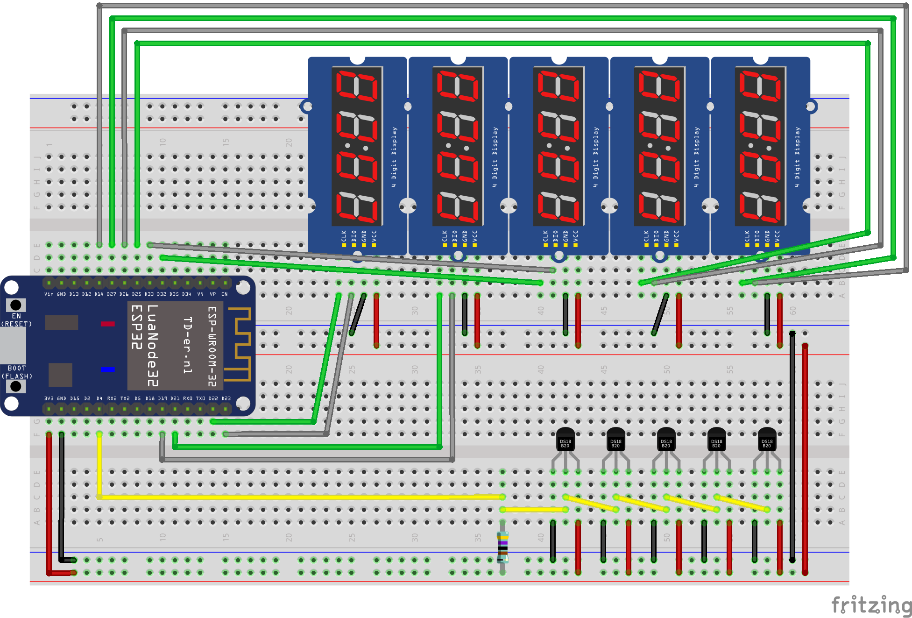

Temperature Monitor
===================

Monitor 5 temperatur sensors and display the readings

Components:
* 1x ESP32 (NodeMCU) with [Micropython](https://www.micropython.org/download#esp32)
* 5x DS18B20
* 5x TM1637




References
----------

* [TM1637 driver](https://github.com/mcauser/micropython-tm1637)

Setup hints
-----------

```bash
esptool.py --chip esp32 --port /dev/ttyUSB0 erase_flash
esptool.py --chip esp32 --port /dev/ttyUSB0 --baud 460800 write_flash -z 0x1000 esp32-20190125-v1.10.bin
ampy -p /dev/ttyUSB0 put display.py display.py
ampy -p /dev/ttyUSB0 put tm1637.py tm1637.py
```

Companion App
=============

See https://github.com/agp8x/temperatureMonitorApp
